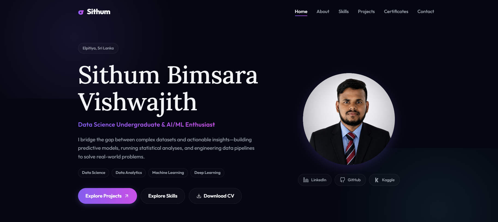

# Personal Portfolio

**Live Demo:** [Insert Deploy Link Here](https://sithumbimsara.vercel.app)



A modern, responsive personal portfolio website built with React and Vite. This portfolio is designed to showcase projects, skills, experience, and certificates, providing a comprehensive professional profile.

## Features

- **Responsive Design**: Fully responsive layout that looks great on devices of all sizes (desktop, tablet, and mobile).
- **Modern UI**: Clean and aesthetically pleasing user interface with smooth scrolling and interactive components.
- **Sections Included**:
  - **Hero**: Introduction and greeting.
  - **About**: Personal background and professional summary.
  - **Skills**: Display of technical and soft skills.
  - **Projects**: Showcase of past work with links and descriptions.
  - **Certificates**: Highlights of professional certifications.
  - **Contact**: Contact information and links to social profiles.
- **Icons**: Utilizes `lucide-react` for beautiful, scalable SVG icons.

## Technologies Used

- **Framework**: [React 19](https://react.dev/)
- **Build Tool**: [Vite](https://vitejs.dev/)
- **Styling**: Vanilla CSS
- **Icons**: [Lucide React](https://lucide.dev/)
- **Linting**: ESLint

## Getting Started

Follow these instructions to set up the project locally on your machine.

### Prerequisites

Make sure you have [Node.js](https://nodejs.org/) installed on your machine.

### Installation

1. Clone the repository:
   ```bash
   git clone <repository-url>
   ```
2. Navigate into the project directory:
   ```bash
   cd personal-portfolio
   ```
3. Install the dependencies:
   ```bash
   npm install
   ```

### Running Locally

To start the development server, run:
```bash
npm run dev
```
The application will be available at `http://localhost:5173/`.

## Available Scripts

In the project directory, you can run:

- `npm run dev`: Starts the development server with Hot Module Replacement (HMR).
- `npm run build`: Builds the app for production to the `dist` folder.
- `npm run lint`: Runs ESLint to check for code quality and formatting issues.
- `npm run preview`: Bootstraps a local server to preview the production build.

## Project Structure

```
src/
├── assets/          # Static assets (images, etc.)
├── components/      # React components (Navbar, Hero, About, etc.)
├── App.css          # Global application styles
├── App.jsx          # Root application component
├── index.css        # Entry CSS file
└── main.jsx         # Application entry point
```

## Customization

To customize this portfolio for your own use:
1. Update the personal information, project details, and skills in the components within `src/components/`.
2. Replace assets (like profile pictures or resumes) in the `src/assets/` directory.
3. Modify the styling in the respective component `.css` files or global `App.css`/`index.css` files to match your preferred theme.
